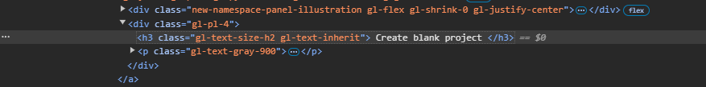

## Summary (Summarize the bug encountered concisely)

    When navigating to project creation page and trying to create a new project a bug was encountered. 
    The button for "Create blank project" contains a typo and is now labeled as "Create black project".
    Word "blank" is replaced with "black".

## Steps to reproduce     

    To reproduce the issue navigate to project creation page and select "New project". The bug
    is visible on the project creation page on the "Create blank project"-button.

## What is the current bug behavior?

     The project creation button is still functional but there is a typo in the creation button. Button displays
     "Create black project"

## What is the expected correct behavior?

    The button for new project creation should say "Create blank project".
     
## Relevant logs and/or screenshots

    ```  <h3 class="gl-text-size-h2 gl-text-inherit"> Create black project </h3> ```

## Possible fixes

    Line of code that needs to be fixed:
    ```  <h3 class="gl-text-size-h2 gl-text-inherit"> Create black project </h3> ```
    Line of code should be:
    ```  <h3 class="gl-text-size-h2 gl-text-inherit"> Create blank project </h3> ```

    

## Whom do you report/ Assign To/ Tags

    /label ~bug ~reproduced ~needs-investigation 
      /cc @project-manager 
      /assign @qa-tester

## Priority

      A minor bug. Does not alter the functionality of the page or button but is a visible typo in the project creation page.
